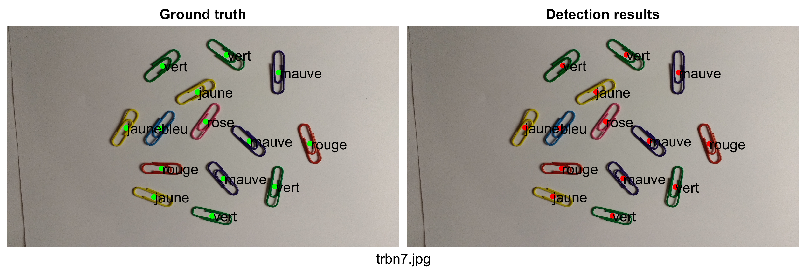
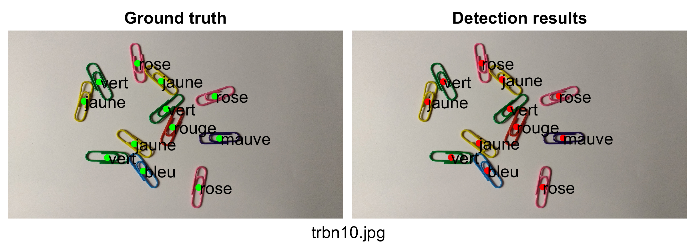

# Paperclip Detection (MATLAB and K-means)

## Description
This repository extends a lab from the **GPA659** course at **ÉTS Montréal**. It detects paperclips and their colors in images, compares the results with the ground truth and exports side-by-side figures for visualization.

## Quick Start
Clone the repository:
```bash
git clone https://github.com/nellbru/paperclip-detection-matlab-kmeans.git
cd paperclip-detection-matlab-kmeans
```

Open MATLAB and run `test_detect_paperclips.m`.

This script loads the images, runs the detector, and exports side-by-side figures (ground truth vs. detection) to the `Results/` folder.

## Results
All generated figures are saved to **Results/**. Each figure shows, for a given image, the **ground truth on the left** and the **detection on the right**.

<p align="center">
  
  
</p>

## Project Structure
    paperclip-detection-matlab-kmeans/
    ├─ Images/                   # Input images and ground truth (.mat)
    ├─ Results/                  # Exported side-by-side figures
    ├─ detect_paperclips.m       # Detection function
    ├─ test_detect_paperclips.m  # Script to run the full pipeline
    ├─ .gitignore                # Ignore rules for Git
    ├─ LICENSE                   # Project license
    └─ README.md                 # Project documentation

## Requirements
- MATLAB (R2018b or newer)

## License
This project is licensed under the terms of the [LICENSE](LICENSE) file.
